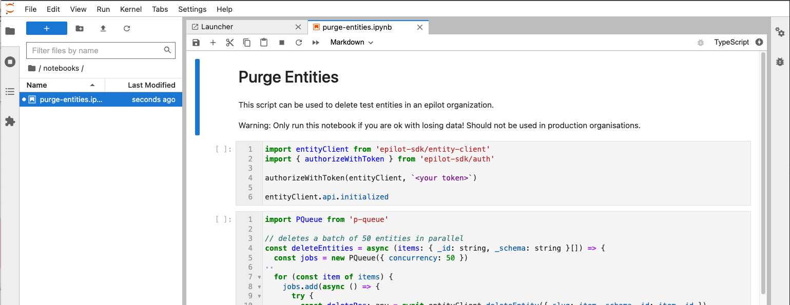

# epilot API/SDK examples

Uses [epilot-sdk](https://github.com/epilot-dev/sdk-js) with [Jupyter Lab](https://jupyter.org/).



## Quick Start

```
npm install
jupyter-lab # notebooks running at http://localhost:8888/
```

## Requirements

- [python3.x](https://www.python.org/downloads/)
- [nodejs>=16](https://nodejs.org/en/download/)
- [Jupyter Lab](https://jupyter.org/install)
- [cmake](https://cmake.org/download/)

## Installation

Clone this repository and install dependencies

```
git clone https://github.com/epilot-dev/sdk-examples.git
cd sdk-examples/
npm install
```

If not yet installed, install and build jupyter lab using pip:

```
pip install jupyterlab
jupyter-lab build
```

You'll need to install the [tslab TypeScript kernel](https://github.com/yunabe/tslab)

```
npm install -g tslab
tslab install
```

You should now be able to run jupyter-lab and use the typescript kernel

```
jupyter-lab # notebooks running at http://localhost:8888/
```
